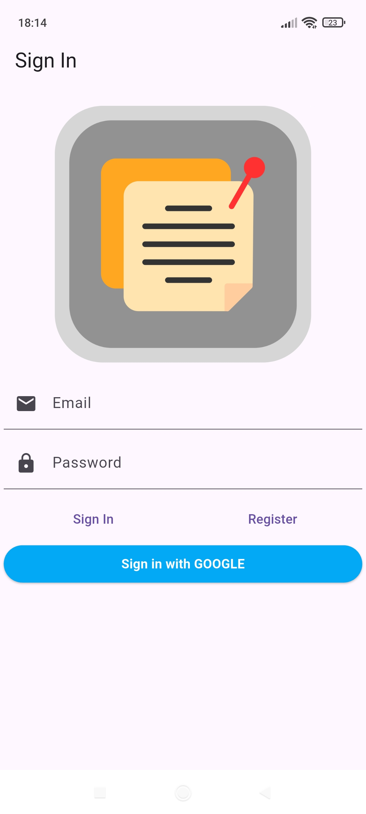
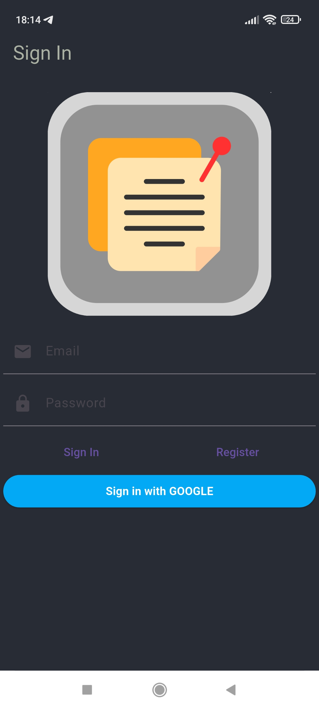
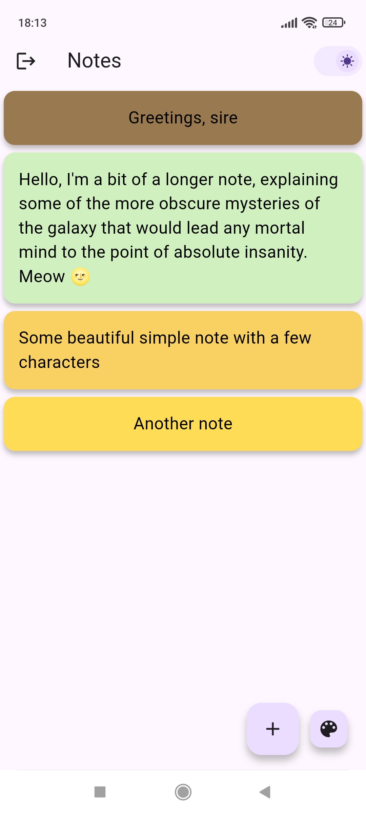
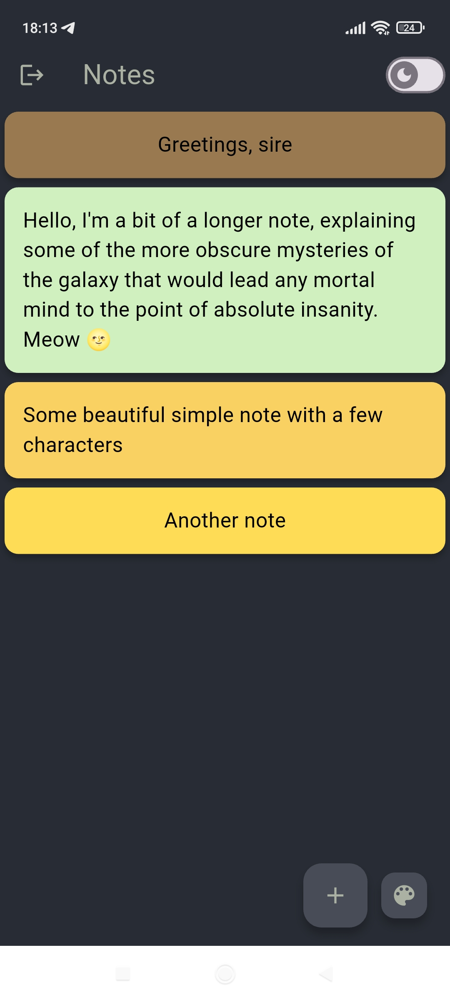
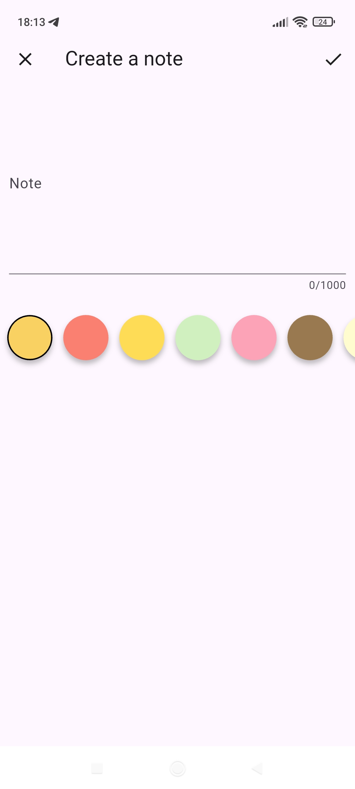
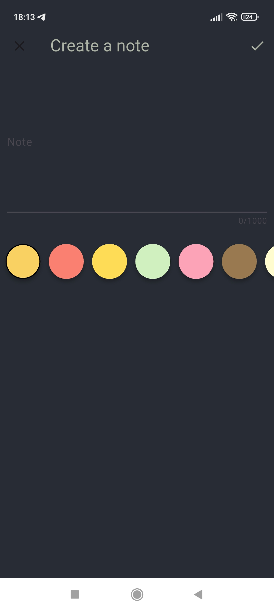
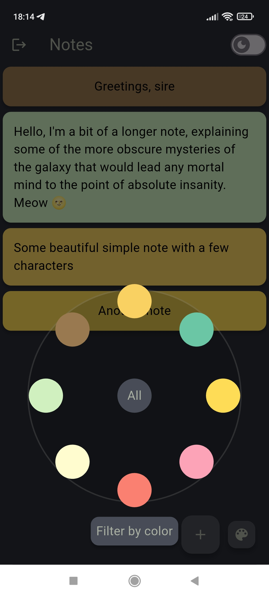

## 💫 About The Project
A color note app with realtime syncronization and filtering

## ✨ Features

- [x] Login with Google/Email to save your notes
- [x] Create notes.
- [x] Update/Delete notes.
- [x] Filter your notes
- [x] Dark mode

An application that follows Domain Driven Design and clean architecture principles. There are also elements of functional programming

Приложение, которое следует принципам Domain Driven Design и чистой архитектуры. Также присутсвуют элементы функционального программирования

## 📸 ScreenShots

| Light                             | Dark                              |
| --------------------------------- | --------------------------------- |
|   |   |
|   |   |
|   |   |
|   |   |

## Downloads

apk - ...
